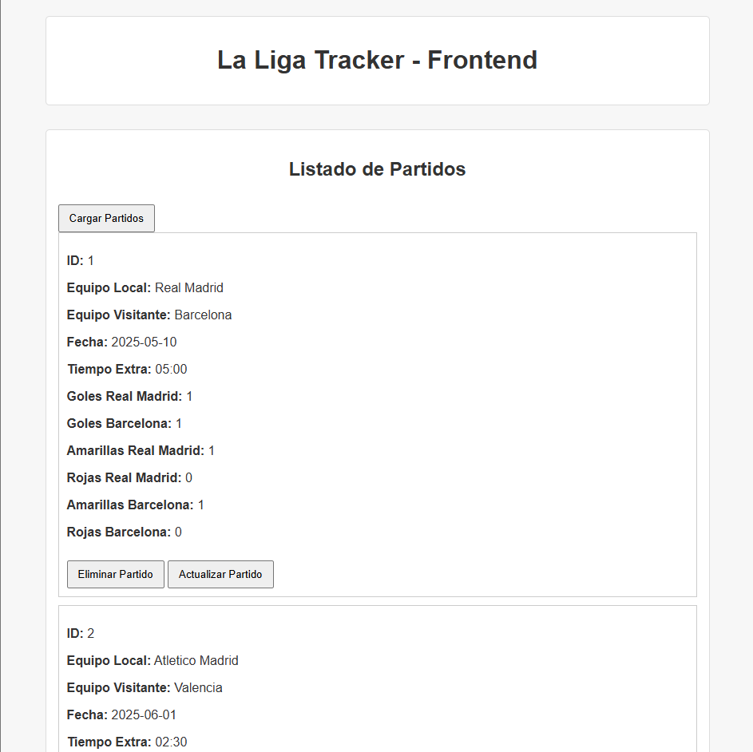
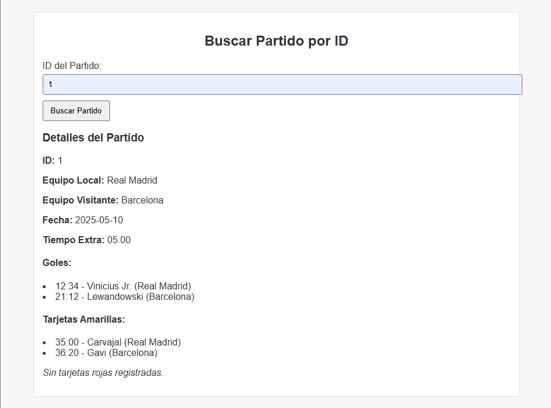
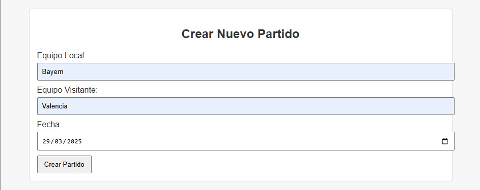
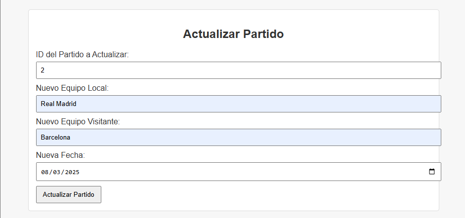
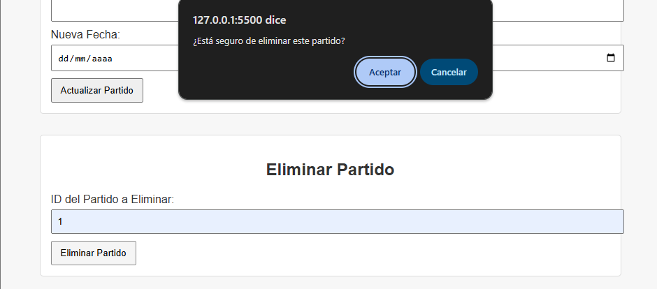
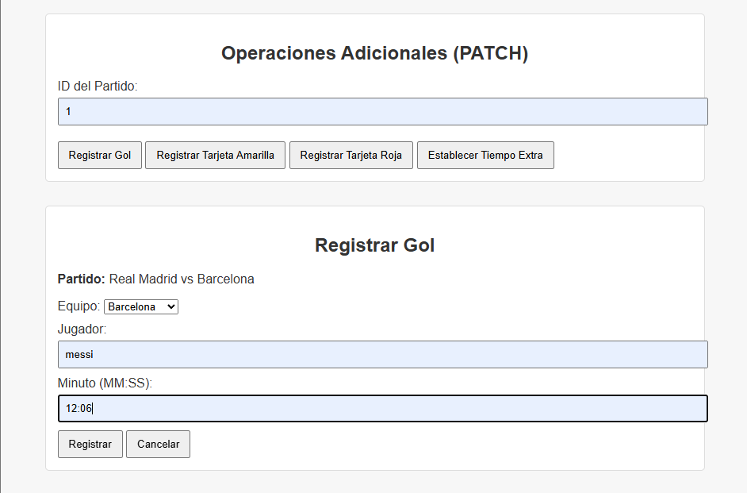
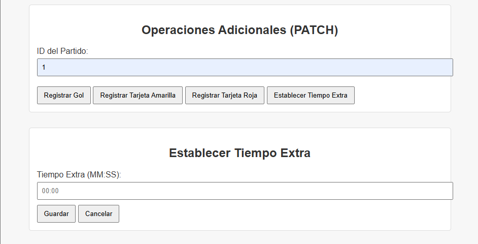

# Lab 6 Backend only: Desarrollo de Backend para La Liga Tracker
 
 **Universidad del Valle de Guatemala**  
 **Facultad de Ingeniería**  
 **Departamento de Ciencias de la Computación**  
 **Sistemas y Tecnologías Web**  
 
## Autor
- Diego Leiva - 21752


## ⚽ La Liga Tracker – API REST

Esta API permite gestionar partidos de fútbol, incluyendo:
- Crear, consultar, actualizar y eliminar partidos.
- Registrar goles, tarjetas amarillas y rojas.
- Establecer tiempo extra.
- Consultar eventos de cada partido.


### 📌 Base URL

```bash
http://localhost:8080/api
```


### 📖 Documentación Swagger

Para ver la documentación completa con ejemplos y probar los endpoints desde el navegador:

```bash
http://localhost:8080/swagger/index.html
```


### 📦 Endpoints principales

#### Obtener todos los partidos
```bash
GET /api/matches
```

#### Obtener partido por ID
```bash
GET /api/matches/{id}
```

#### Crear nuevo partido
```bash
POST /api/matches
Content-Type: application/json

{
  "homeTeam": "Real Madrid",
  "awayTeam": "Barcelona",
  "matchDate": "2025-05-10"
}
```

#### Actualizar partido
```bash
PUT /api/matches/{id}
Content-Type: application/json

{
  "homeTeam": "Real Madrid",
  "awayTeam": "Barcelona",
  "matchDate": "2025-05-11"
}
```

#### Eliminar partido
```bash
DELETE /api/matches/{id}
```


### ⚽ Eventos del partido

#### Registrar gol
```bash
PATCH /api/matches/{id}/goals
Content-Type: application/json

{
  "team": "Real Madrid",
  "player": "Cristiano Ronaldo",
  "minute": "45"
}
```

#### Registrar tarjeta amarilla
```bash
PATCH /api/matches/{id}/yellow_cards
Content-Type: application/json

{
  "team": "Barcelona",
  "player": "Xavi",
  "minute": "30"
}
```

#### Registrar tarjeta roja
```bash
PATCH /api/matches/{id}/red_cards
Content-Type: application/json

{
  "team": "Real Madrid",
  "player": "Sergio Ramos",
  "minute": "88"
}
```

#### Establecer tiempo extra
```bash
PATCH /api/matches/{id}/extratime
Content-Type: application/json

{
  "extraTime": "05:00"
}
```


### 🛠️ Cómo levantar el servidor con Docker

Si usás `docker-compose`, ejecutá:

```bash
docker compose up --build
```

El backend correrá en `http://localhost:8080`.


### 🖥️ GUI – Interfaz gráfica del cliente

La siguiente interfaz permite interactuar visualmente con la API de La Liga Tracker. Desde esta aplicación web, los usuarios pueden:

- Visualizar la lista de partidos disponibles.
- Ver detalles de cada partido, incluyendo eventos registrados.
- Agregar nuevos partidos.
- Actualizar datos de un partido.
- Eliminar un partido.
- Registrar goles, tarjetas amarillas y rojas.
- Establecer el tiempo extra.

#### 🏠 Página principal – Lista de partidos
Muestra todos los partidos registrados en la base de datos.



#### 📋 Detalle de partido
Vista detallada de un partido, con goles, tarjetas y tiempo extra.



#### ➕ Crear nuevo partido
Formulario para ingresar los datos de un nuevo partido.



#### ✏️ Actualizar partido
Permite editar la información de un partido existente.



#### ❌ Eliminar partido
Opción para eliminar un partido con confirmación.




#### ⚽ Registrar evento
Vista para agregar un gol, tarjeta amarilla o tarjeta roja a un partido específico.



#### ⏱️ Establecer tiempo extra
Permite definir el tiempo extra agregado al partido.


